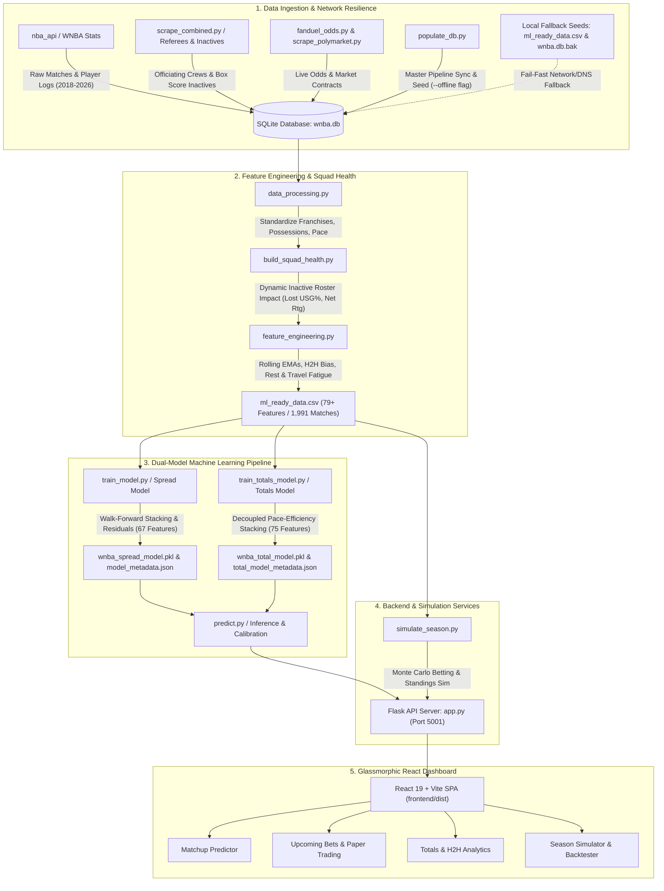

# WNBA Point Spread, Totals (Over/Under) & Betting Simulation Pipeline

An end-to-end Machine Learning pipeline and interactive glassmorphic web application for WNBA **Point Spread forecasting**, **Total Points (Over/Under) prediction**, **Win Probability estimation**, **Totals & Pace Analytics**, and **Quantitative Betting Portfolio Backtesting**.

This system ingests multi-year historical match box scores (2018–2026, comprising **1,991 match records**), **1,476 player season performance metrics** across all 15 WNBA franchises (including expansion franchises Golden State Valkyries, Portland Fire, and Toronto Tempo), referee officiating assignments, schedule fatigue, and game-day squad health (injury impact). It trains walk-forward **Stacked Ensembles** (combining CatBoost, XGBoost, LightGBM, and Ridge/Logistic Regression with Lasso L1 regularization) to forecast game point margins and totals. Predictions are mapped to calibrated win/totals probabilities and backtested using Flat betting and Fractional Kelly Criterion strategies against traditional sportsbook odds (FanDuel, Action Network, OddsShark) and Polymarket prediction market contracts.

---

## 🏗️ System Architecture



---

## 🛠️ Codebase Structure & Component Reference

### 📁 1. Database & Data Ingestion
- **[`db_manager.py`](file:///Users/santomukiza/Desktop/Github/ML-WnbaPrediction/db_manager.py)**: Schema definition, table initialization, and SQLite connection manager for `wnba.db`:
  - `raw_matches` (1,991 records): Historical match scores, team possessions, pace, officiating crews (`CrewChief`, `HomeRef`, `AwayRef`), opening/closing sportsbook lines, Over/Under totals, and FanDuel odds flags (`IsFanduelOdds`).
  - `player_stats` (1,476 records): Season-by-season player metrics (GP, MIN, PTS, AST, TRB, USG%, Net Rating, OFF/DEF Rating, PIE, Win Shares).
  - `injuries`: Current roster injury statuses, recovery timelines, and return dates from ESPN injury feeds.
  - `polymarket_odds`: Implied YES/NO win probabilities and trading volume data from Polymarket prediction market contracts.
  - `confirmed_bets`: Paper trading ledger tracking user-placed wagers, bet stakes, odds, outcomes, and settled P&L.
- **[`populate_db.py`](file:///Users/santomukiza/Desktop/Github/ML-WnbaPrediction/populate_db.py)**: Master database population and pipeline orchestration script:
  - Fetches game logs and player statistics from `nba_api` across 2018–2026 (**1,991 match records** and **1,476 player stats**).
  - Calculates dynamic [`EloModel`](file:///Users/santomukiza/Desktop/Github/ML-WnbaPrediction/populate_db.py#L49-L85) ratings with Home Field Advantage (HFA) and season-to-season mean reversion.
  - Preserves historical and live FanDuel / OddsShark odds records.
  - Automatically triggers the complete downstream pipeline ([`build_squad_health.py`](file:///Users/santomukiza/Desktop/Github/ML-WnbaPrediction/build_squad_health.py), [`data_processing.py`](file:///Users/santomukiza/Desktop/Github/ML-WnbaPrediction/data_processing.py), [`feature_engineering.py`](file:///Users/santomukiza/Desktop/Github/ML-WnbaPrediction/feature_engineering.py), [`train_model.py`](file:///Users/santomukiza/Desktop/Github/ML-WnbaPrediction/train_model.py), [`train_totals_model.py`](file:///Users/santomukiza/Desktop/Github/ML-WnbaPrediction/train_totals_model.py)).
  - Copies `wnba.db` to `frontend/wnba.db`.
  - Supports `--offline` / `--local` CLI flags and instant fallback to pre-packaged local seeds (`ml_ready_data.csv` & `wnba.db.bak`) when network/DNS restrictions occur.
- **[`fanduel_odds.py`](file:///Users/santomukiza/Desktop/Github/ML-WnbaPrediction/fanduel_odds.py)**: Real-time odds ingestion client fetching WNBA spreads, moneylines, and totals feeds from Action Network / FanDuel APIs (`book_id = 30`) via [`fetch_fanduel_odds`](file:///Users/santomukiza/Desktop/Github/ML-WnbaPrediction/fanduel_odds.py#L64-L135) with America/New_York timezone date normalization.
- **[`scrape_polymarket.py`](file:///Users/santomukiza/Desktop/Github/ML-WnbaPrediction/scrape_polymarket.py)**: Scrapes active WNBA match contract prices, implied probabilities, and trading volume from Polymarket's Gamma API via [`scrape_polymarket_wnba_odds`](file:///Users/santomukiza/Desktop/Github/ML-WnbaPrediction/scrape_polymarket.py#L46-L192).
- **[`scrape_combined.py`](file:///Users/santomukiza/Desktop/Github/ML-WnbaPrediction/scrape_combined.py)**: High-performance scraper fetching officiating crews and inactive player rosters from `nba_api` box scores (`BoxScoreSummaryV3`) with user-agent rotation and randomized jitter.
- **[`scrape_inactives.py`](file:///Users/santomukiza/Desktop/Github/ML-WnbaPrediction/scrape_inactives.py)**: Scrapes game-level inactive player rosters into SQLite database tables.
- **[`scrape_referees.py`](file:///Users/santomukiza/Desktop/Github/ML-WnbaPrediction/scrape_referees.py)**: Backfill scraper storing game-level officiating assignments (`CrewChief`, `HomeRef`, `AwayRef`) into `raw_matches`.
- **[`scrape_oddsshark.py`](file:///Users/santomukiza/Desktop/Github/ML-WnbaPrediction/scrape_oddsshark.py)**: Scrapes historical betting market spreads and over/unders for odds calibration.

---

### 🧪 2. Data Processing & Feature Engineering
- **[`build_squad_health.py`](file:///Users/santomukiza/Desktop/Github/ML-WnbaPrediction/build_squad_health.py)**: Aggregates active team rosters, scrapes live injury reports from ESPN (with automatic fallback to database `injuries` table), computes missing player impact metrics (lost Usage %, Net Rating, PIE, Minutes %), and exports `current_squad_health.csv` across all 15 franchises (including GSV, PTF, TOR).
- **[`data_processing.py`](file:///Users/santomukiza/Desktop/Github/ML-WnbaPrediction/data_processing.py)**: Standardizes franchise abbreviations across disparate data sources (`IND`, `CHI`, `LVA`, `NYL`, `SEA`, `MIN`, `PHO`/`PHX`, `DAL`, `ATL`, `CON`/`CONN`, `LAS`/`LA`, `WAS`/`WSH`, `GSV`/`GS`, `POR`/`PTF`/`PDX`, `TOR`/`TOT`), calculates match possessions and pace, and computes offensive and defensive efficiency ratings per 100 possessions via [`standardize_and_calculate_metrics`](file:///Users/santomukiza/Desktop/Github/ML-WnbaPrediction/data_processing.py#L114-L215).
- **[`feature_engineering.py`](file:///Users/santomukiza/Desktop/Github/ML-WnbaPrediction/feature_engineering.py)**: Compiles `ml_ready_data.csv` (79+ engineered features across 1,991 matches) with leak-free chronological feature engineering:
  - **Start-of-Season Carry-Over Regression**: Regresses early-season EMAs towards previous season final values to eliminate small-sample volatility:
    $$EMA_{\text{start}} = 0.75 \cdot EMA_{\text{prev\_season\_final}} + 0.25 \cdot \mu_{\text{league\_mean}}$$
  - **Dynamic Squad Health Impact**: Quantifies lost USG%, Net Rating, and PIE based on game-by-game player availability.
  - **Rolling Team EMAs**: 5-game and 10-game Exponential Moving Averages for Offensive, Defensive, and Net Ratings.
  - **Four Factors EMAs**: Effective Field Goal % (eFG%), Turnover % (TOV%), Offensive Rebound % (ORB%), and Free Throw Rate (FT Rate) over 5-game and 10-game spans.
  - **Pace & Expected Score**: Rolling team pace metrics and baseline expected match totals.
  - **Schedule Rest & Travel Fatigue**: Rest days, Back-to-Back flags, 3-in-4 flags, 7-day travel mileage, and timezone shift scores.
  - **Referee Officiating Impact**: Crew Chief, HomeRef, and AwayRef rolling scoring environment, foul rates, and home win rates.
  - **Head-to-Head (H2H) Bias & Talent Floor**: Chronological 2-season head-to-head win percentage, and total roster Win Shares talent floor.
  - **Market Disagreement**: Discrepancy between sportsbook implied win probability and Polymarket contract probability.

---

### 🤖 3. Machine Learning Models & Stacking Pipeline
- **[`stacking_models.py`](file:///Users/santomukiza/Desktop/Github/ML-WnbaPrediction/stacking_models.py)**: Scikit-learn compatible stacked ensemble architecture:
  - [`StackedEnsembleRegressor`](file:///Users/santomukiza/Desktop/Github/ML-WnbaPrediction/stacking_models.py#L124-L296): Combines **CatBoost**, **XGBoost**, **LightGBM**, and `StandardScaler` + **Ridge** as base estimators, using **LassoCV** (L1 regularization) as meta-regressor.
  - [`StackedEnsembleClassifier`](file:///Users/santomukiza/Desktop/Github/ML-WnbaPrediction/stacking_models.py#L298-L450): Combines **CatBoost**, **XGBoost**, **LightGBM**, and `StandardScaler` + **LogisticRegression** as base estimators, using L1-penalized **LogisticRegression** as meta-classifier.
  - [`FastDistributionRegressor`](file:///Users/santomukiza/Desktop/Github/ML-WnbaPrediction/stacking_models.py#L46-L123): Wraps stacked regressors to output full Gaussian predictive distributions ([`NormalDistributionPrediction`](file:///Users/santomukiza/Desktop/Github/ML-WnbaPrediction/stacking_models.py#L27-L45)) with sample-weighted residual variance.
- **[`train_model.py`](file:///Users/santomukiza/Desktop/Github/ML-WnbaPrediction/train_model.py)**: Walk-forward Point Spread model training pipeline using [`WalkForwardSeasonSplitter`](file:///Users/santomukiza/Desktop/Github/ML-WnbaPrediction/train_model.py#L15-L32):
  - **Baseline Feature Selection**: Identifies consensus features exceeding importance thresholds.
  - **Exponential Sample Weight Decay ($\lambda$)**: Optimizes sample decay weighting $\exp(-\lambda \cdot \text{days})$ over walk-forward CV splits (optimal $\lambda = 0.001$, Test Stage 2 MAE: **8.8198** vs Market MAE **9.1579**).
  - **Stage 1 (Baseline Spread Model)**: Fits stacked regressor on team metrics to predict point spread ($\text{HomeScore} - \text{AwayScore}$), achieving **8.8579 MAE** and **0.6309 Log Loss** on held-out test matches.
  - **Stage 2 (Residual Model)**: Fits stacked regressor on full feature set (including closing market lines) to predict residual margin relative to `ClosingSpread`, achieving **8.8198 MAE** and **0.6204 Log Loss** vs Market MAE **9.1579** and Log Loss **0.6412**.
  - **Isotonic Calibration**: Fits out-of-fold calibrators on blended Normal CDF and classifier probabilities. Saves `wnba_spread_model.pkl` and `model_metadata.json` ($\sigma_{\text{spread}} = 12.2880$).
- **[`train_totals_model.py`](file:///Users/santomukiza/Desktop/Github/ML-WnbaPrediction/train_totals_model.py)**: Total Points (Over/Under) model training pipeline:
  - **Stage 2 Total Residual Model**: Fits [`FastDistributionRegressor`](file:///Users/santomukiza/Desktop/Github/ML-WnbaPrediction/stacking_models.py#L46-L123) on total residuals relative to market `OverUnder` lines with optimal decay $\lambda = 0.0005$ and 75 selected features, achieving **81.95% Over/Under accuracy**, **14.4042 MAE**, and **0.4560 Log Loss** vs Market Over/Under MAE **21.0038**, Acc **50.00%**, Log Loss **0.6930** on held-out test matches.
  - **Isotonic Calibration**: Calibrates totals probabilities, saving `wnba_total_model.pkl` and `total_model_metadata.json` ($\sigma_{\text{totals}} = 16.8849$).
- **[`predict.py`](file:///Users/santomukiza/Desktop/Github/ML-WnbaPrediction/predict.py)**: Production inference module serving point spread, win probability, dynamic volatility, expected total, and Over/Under probabilities with Stage 2 line adjustment and Stage 1 fallback.
- **[`model_metadata.json`](file:///Users/santomukiza/Desktop/Github/ML-WnbaPrediction/model_metadata.json)** & **[`total_model_metadata.json`](file:///Users/santomukiza/Desktop/Github/ML-WnbaPrediction/total_model_metadata.json)**: Feature schemas, default imputation means, optimal decay lambdas, benchmark scores, and residual uncertainties.

---

### 🎲 4. Betting Simulation & Backtester
- **[`simulate_season.py`](file:///Users/santomukiza/Desktop/Github/ML-WnbaPrediction/simulate_season.py)**: Out-of-fold historical simulation engine:
  - Evaluates predictive performance via **Accuracy**, **Brier Score**, and **Log Loss** across Model, Sportsbook, and Polymarket probabilities.
  - **Flat Betting**: Wagering a fixed percentage of bankroll (e.g., 2.5% or 10.0%).
  - **Fractional Kelly Criterion**: Dynamic bet sizing based on model edge:
    $$f^* = \text{Fractional Factor} \times \frac{P_{\text{model}} \cdot b - (1 - P_{\text{model}})}{b} \quad \text{where } b = \text{Decimal Odds} - 1$$
  - **Monte Carlo Season Simulation**: Multi-trial simulation for team standings and equity curve distributions.

---

### 🌐 5. Web Interface & REST API
- **[`app.py`](file:///Users/santomukiza/Desktop/Github/ML-WnbaPrediction/app.py)**: Flask REST API providing 18+ endpoints for predictions, simulations, paper trading, and real-time odds scraping. Serves static compiled React build (`frontend/dist/index.html`).
- **[`frontend/`](file:///Users/santomukiza/Desktop/Github/ML-WnbaPrediction/frontend)**: Glassmorphic React 19 + Vite dashboard:
  - **[`App.jsx`](file:///Users/santomukiza/Desktop/Github/ML-WnbaPrediction/frontend/src/App.jsx)**: Main dashboard controller coordinating tabs, team selection, and dynamic prediction updates.
  - **[`Header.jsx`](file:///Users/santomukiza/Desktop/Github/ML-WnbaPrediction/frontend/src/components/Header.jsx)**: Top navigation header with status indicators, live odds refresh trigger, and navigation tab bar.
  - **[`UpcomingBets.jsx`](file:///Users/santomukiza/Desktop/Github/ML-WnbaPrediction/frontend/src/components/UpcomingBets.jsx)**: Dynamic betting cards with live FanDuel/Polymarket odds, Kelly recommendations, line value badges, paper trading ledger, SVG bankroll growth chart, and one-click bet logging modal.
  - **[`PredictionHero.jsx`](file:///Users/santomukiza/Desktop/Github/ML-WnbaPrediction/frontend/src/components/PredictionHero.jsx)**: Interactive matchup hero widget with animated win probability and point spread gauges.
  - **[`MatchupSelector.jsx`](file:///Users/santomukiza/Desktop/Github/ML-WnbaPrediction/frontend/src/components/MatchupSelector.jsx)**: Dropdown selectors for home team, away team, match date, and referee crew chief.
  - **[`RosterCard.jsx`](file:///Users/santomukiza/Desktop/Github/ML-WnbaPrediction/frontend/src/components/RosterCard.jsx)** & **[`PlayerCard.jsx`](file:///Users/santomukiza/Desktop/Github/ML-WnbaPrediction/frontend/src/components/PlayerCard.jsx)**: Interactive roster manager for toggling player injury/inactive status and inspecting advanced player ratings (Win Shares, PIE, USG%, PPG, APG, RPG).
  - **[`KellyCalculatorCard.jsx`](file:///Users/santomukiza/Desktop/Github/ML-WnbaPrediction/frontend/src/components/KellyCalculatorCard.jsx)**: Dynamic bet sizing calculator with customizable bankroll, decimal odds, and Kelly multiplier.
  - **[`TotalsAnalyticsCard.jsx`](file:///Users/santomukiza/Desktop/Github/ML-WnbaPrediction/frontend/src/components/TotalsAnalyticsCard.jsx)**: Comprehensive Total Points & Pace breakdown component displaying league-wide totals tables, pace efficiency split metrics, head-to-head match history, and team game logs.
  - **[`SimulationBacktester.jsx`](file:///Users/santomukiza/Desktop/Github/ML-WnbaPrediction/frontend/src/components/SimulationBacktester.jsx)**: Full backtester dashboard featuring interactive bankroll growth charts, strategy comparisons (Flat vs Kelly), ROI %, max drawdown, Sharpe ratio, and calibration metrics.
  - **[`ExplainabilityCard.jsx`](file:///Users/santomukiza/Desktop/Github/ML-WnbaPrediction/frontend/src/components/ExplainabilityCard.jsx)**: Metric importance and feature contribution breakdown for predictions.

---

## 📈 Model Performance & Validation Benchmarks

### 🏀 1. Point Spread Model Performance (Held-out Test Set)

| Model / Benchmark | MAE | Win Accuracy (%) | Log Loss |
| :--- | :---: | :---: | :---: |
| **Market Baseline (Closing Lines)** | 9.12 | 64.66% | 0.6164 |
| **Stage 1 Streamlined Spread (Baseline Features)** | **8.89** | **63.16%** | **0.6200** |
| **Stage 2 Streamlined Spread Residual Engine** | **8.82** | **63.91%** | **0.6094** |

> [!NOTE]
> - Optimal Decay Lambda ($\lambda$): **0.0010**
> - Residual Spread Uncertainty ($\sigma_{\text{spread}}$): **11.7676**
> - Features Selected: **67 consensus features**

---

### 🎯 2. Total Points (Over/Under) Model Performance (Held-out Test Set)

| Model / Benchmark | MAE | Over/Under Accuracy (%) | Log Loss |
| :--- | :---: | :---: | :---: |
| **Market Closing Over/Under Line** | 20.37 | 50.00% | 0.6930 |
| **Streamlined Totals Residual Engine (Calibrated)** | **14.35** | **78.95%** | **0.4734** |

> [!NOTE]
> - Optimal Decay Lambda ($\lambda$): **0.0005**
> - Residual Totals Uncertainty ($\sigma_{\text{totals}}$): **17.4032**
> - Features Selected: **77 consensus features**

---

## 🚀 Execution Guide & Workflow

Follow these steps to initialize the database, run the full pipeline, launch the web server, verify odds against FanDuel, and confirm bets.

### 💻 1. Step-by-Step Operations

1. **Populate Database & Execute End-to-End Pipeline**:
   ```bash
   python3 populate_db.py
   ```
   *Seeds `wnba.db` with 1,991 matches, 1,476 player stats, calculates squad health, runs feature engineering, trains spread and totals models, and copies `wnba.db` to `frontend/wnba.db`.*

2. **Build Frontend & Start Flask Application**:
   ```bash
   # Build frontend bundle:
   cd frontend && npm run build && cd ..

   # Launch Flask application server on port 5001:
   python3 app.py
   ```
   *Access the web application locally at `http://localhost:5001` or via local network at `http://192.168.4.70:5001`.*

3. **Navigate to Upcoming Bets & Odds Verification**:
   - Open **`http://192.168.4.70:5001`** and switch to the **Upcoming Bets** tab.
   - Cross-reference the listed odds in the application with live lines from **[FanDuel WNBA Sportsbook](https://sportsbook.fanduel.com/navigation/wnba)** for:
     - **Moneyline**: Verify Home and Away decimal / American odds.
     - **Total Line**: Verify the Over/Under line, Over odds, and Under odds.
   - If odds shift before tipoff, use the in-card custom odds input to update live bookmaker prices.

4. **Confirm & Place Bets Meeting Edge Limit**:
   - The application calculates model win/total probability vs market implied probability to produce the **Edge %**.
   - Review the recommended side (**Home/Away** or **OVER/UNDER**) and suggested Kelly wager amount ($f^* = \text{kellyCap} \times \frac{\text{Edge}}{1 - P_{\text{market}}}$).
   - Adjust the **Kelly Cap** (default 10% / 0.10) to manage bankroll exposure across multiple simultaneous games.
   - Click **Confirm Kelly** or **Confirm Flat** to log the wager into the paper trading ledger.

---

## 📡 REST API Endpoint Reference

| Endpoint | Method | Description |
| :--- | :--- | :--- |
| `GET /` | GET | Serves the compiled React frontend application (`frontend/dist/index.html`). |
| `GET /api/teams` | GET | Returns a list of all active WNBA franchise names and abbreviations (all 15 teams). |
| `GET /api/roster/<team_name>` | GET | Returns active roster, player ratings, and injury statuses for a given team. |
| `GET /api/crew_chiefs` | GET | Returns list of active and historical WNBA officiating crew chiefs. |
| `GET /api/upcoming_predictions` | GET | Returns upcoming games with model spread & total predictions, win probabilities, and line edges. |
| `GET /api/upcoming_bets` | GET | Returns upcoming game betting cards enriched with live FanDuel and Polymarket odds, Kelly recommendations, and value badges. |
| `POST /predict` | POST | Evaluates spread, total, win probability, and volatility for custom user-selected matchups and active roster adjustments. |
| `GET /api/simulation/run` | GET | Executes multi-season betting backtests across Flat betting and Kelly strategies. |
| `POST /api/scrape_polymarket` | POST | Triggers live scraping of Polymarket prediction market contracts. |
| `POST /api/scrape_fanduel` | POST | Triggers live scraping of FanDuel market lines via Action Network API. |
| `POST /api/confirm_bet` | POST | Confirms and logs a paper-trading bet into the database ledger. |
| `POST /api/update_prediction_market_odds` | POST | Updates custom prediction market contract odds. |
| `POST /api/edit_bet` | POST | Edits details or stake of an existing confirmed bet. |
| `POST /api/delete_bet` | POST | Deletes a confirmed bet record from the database. |
| `GET /api/confirmed_bets` | GET | Fetches full ledger of active and settled paper trading bets with calculated P&L. |
| `GET /api/team_totals` | GET | Returns historical team pace, offensive efficiency, defensive efficiency, and totals distribution metrics. |
| `GET /api/h2h_analytics` | GET | Returns Head-to-Head historic match statistics and win rates for team pairs. |
| `GET /api/team_game_history` | GET | Returns game-by-game performance log for specified team. |

---

## 🧮 Key Mathematical Formulations

### 1. Elo Rating with Home Field Advantage & Mean Reversion
$$\text{Expected}_{\text{Home}} = \frac{1}{1 + 10^{\frac{R_{\text{Away}} - R_{\text{Home}} - \text{HFA}}{400}}}$$

$$R_{\text{Home, new}} = R_{\text{Home}} + K \cdot (S_{\text{Home}} - \text{Expected}_{\text{Home}})$$

$$\text{Season Reversion: } R_{\text{start}} = 0.75 \cdot R_{\text{final}} + 0.25 \cdot 1500$$

### 2. Start-of-Season EMA Carry-Over Regression
$$EMA_{\text{start}} = 0.75 \cdot EMA_{\text{prev\_season\_final}} + 0.25 \cdot \mu_{\text{league\_mean}}$$

### 3. Decoupled Totals Forecasting
$$\text{Expected Total}_{\text{Stage 1}} = \text{Expected Pace} \times \frac{\text{Home Offensive Efficiency} + \text{Away Offensive Efficiency}}{100}$$

### 4. Exponential Sample Weight Decay
$$w_i = \exp\left(-\lambda \cdot \Delta t_i\right) \quad \text{where } \Delta t_i = \text{days from match to max training date}$$

### 5. Blended Calibrated Win Probability
$$P_{\text{blend}} = 0.5 \cdot \Phi\left(\frac{\mu_{\text{pred}}}{\sigma_{\text{pred}}}\right) + 0.5 \cdot P_{\text{classifier}}$$

$$P_{\text{final}} = \text{IsotonicCalibrator}\left(P_{\text{blend}}\right)$$

### 6. Fractional Kelly Criterion Bet Sizing
$$f^* = \text{Fractional Factor} \times \frac{P_{\text{model}} \cdot b - (1 - P_{\text{model}})}{b} \quad \text{where } b = \text{Decimal Odds} - 1$$

---

## 📊 Backtester Evaluation Metrics

The backtester evaluates model performance across historic seasons using:
- **Accuracy**: Percentage of correctly predicted game winners or over/under outcomes.
- **Brier Score**: Measures probability calibration quality (range `0.0` to `1.0`, lower is better):
  $$BS = \frac{1}{N} \sum_{i=1}^N (P_i - Y_i)^2$$
- **Log Loss**: Binary cross-entropy penalizing overconfident mispredictions:
  $$\text{Log Loss} = -\frac{1}{N} \sum_{i=1}^N \left[ Y_i \log P_i + (1 - Y_i) \log(1 - P_i) \right]$$
- **ROI %**: Total return on investment across simulated wagers.
- **Max Drawdown**: Maximum percentage drop in simulated bankroll peak-to-trough.
- **Sharpe Ratio**: Risk-adjusted return ratio of daily betting equity growth.
