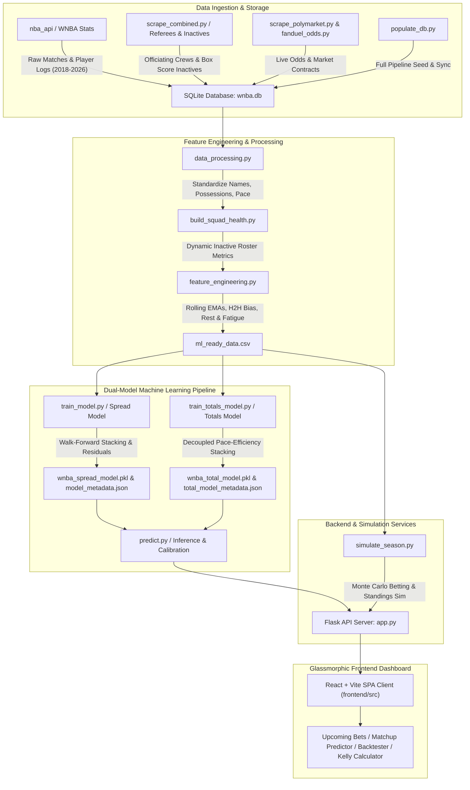

# WNBA Point Spread, Totals & Betting Simulation Pipeline

An end-to-end Machine Learning pipeline and interactive glassmorphic web application for WNBA **Point Spread prediction**, **Total Points (Over/Under) forecasting**, **Win Probability estimation**, and **Betting Portfolio Simulation**.

This system ingests multi-year historical match box scores (2018–2026, comprising **1,929 match records**), **1,498 player season performance metrics**, referee officiating assignments, schedule fatigue, and game-day squad health (injury impact). It trains custom walk-forward **Stacked Ensembles** (combining CatBoost, XGBoost, LightGBM, Random Forest, and Ridge/Logistic Regression with Lasso L1 regularization) to forecast game point margins and totals. Predictions are mapped to calibrated win/totals probabilities and backtested using Flat betting and Fractional Kelly Criterion strategies against traditional sportsbook odds (FanDuel, Action Network, OddsShark) and Polymarket prediction market contracts.

---

## 🏗️ System Architecture



---

## 📂 Codebase Structure & Component Reference

### 🗄️ 1. Database & Data Ingestion
- **[db_manager.py](file:///Users/santomukiza/Desktop/Github/ML-WnbaPrediction/db_manager.py)**: Schema definition and SQLite database manager for `wnba.db`:
  - `raw_matches`: Historic match scores, pace/possessions, actual referee crews (`CrewChief`, `HomeRef`, `AwayRef`), opening/closing sportsbook lines, and FanDuel odds indicators.
  - `player_stats`: Historic WNBA player season metrics (GP, MIN, PTS, AST, TRB, USG%, Net Rating, OFF/DEF Rating, PIE, Win Shares).
  - `injuries`: Current roster injury states, player status, and expected return dates.
  - `polymarket_odds`: Implied YES/NO win probabilities and trading volume data from Polymarket contracts.
  - `confirmed_bets`: Paper trading ledger tracking user-placed wagers, bet stakes, odds, outcomes, and settled P&L.
- **[populate_db.py](file:///Users/santomukiza/Desktop/Github/ML-WnbaPrediction/populate_db.py)**: Primary database population and end-to-end pipeline sync script. Fetches game logs and player stats from `nba_api` across 2018–2026 (1,929 match records and 1,498 player stats), simulates [EloModel](file:///Users/santomukiza/Desktop/Github/ML-WnbaPrediction/populate_db.py#L32-L68) ratings with home field advantage and season mean reversion, seeds `wnba.db`, preserves live FanDuel odds, executes downstream pipelines ([build_squad_health.py](file:///Users/santomukiza/Desktop/Github/ML-WnbaPrediction/build_squad_health.py), [data_processing.py](file:///Users/santomukiza/Desktop/Github/ML-WnbaPrediction/data_processing.py), [feature_engineering.py](file:///Users/santomukiza/Desktop/Github/ML-WnbaPrediction/feature_engineering.py), [train_model.py](file:///Users/santomukiza/Desktop/Github/ML-WnbaPrediction/train_model.py), [train_totals_model.py](file:///Users/santomukiza/Desktop/Github/ML-WnbaPrediction/train_totals_model.py)), and syncs `wnba.db` to `frontend/wnba.db`.
- **[scrape_combined.py](file:///Users/santomukiza/Desktop/Github/ML-WnbaPrediction/scrape_combined.py)**: High-performance single-pass scraper fetching both referee officiating crews and inactive roster logs directly from WNBA API box scores (`BoxScoreSummaryV3`). Features user-agent rotation and randomized jitter to handle rate limits.
- **[scrape_inactives.py](file:///Users/santomukiza/Desktop/Github/ML-WnbaPrediction/scrape_inactives.py)**: Standalone backfill scraper storing game-level inactive player rosters into database tables across historical seasons.
- **[scrape_referees.py](file:///Users/santomukiza/Desktop/Github/ML-WnbaPrediction/scrape_referees.py)**: Standalone backfill scraper storing game-level officiating assignments (`CrewChief`, `HomeRef`, `AwayRef`) into `raw_matches`.
- **[scrape_polymarket.py](file:///Users/santomukiza/Desktop/Github/ML-WnbaPrediction/scrape_polymarket.py)**: Scrapes active WNBA match contract prices, implied probabilities, and market liquidity from Polymarket's Gamma API.
- **[scrape_oddsshark.py](file:///Users/santomukiza/Desktop/Github/ML-WnbaPrediction/scrape_oddsshark.py)**: Scrapes historical betting market spreads and over/unders for baseline odds calibration.
- **[fanduel_odds.py](file:///Users/santomukiza/Desktop/Github/ML-WnbaPrediction/fanduel_odds.py)**: Fetches real-time WNBA spreads, moneylines, and totals feeds from Action Network / FanDuel APIs.

### 🧪 2. Data Processing & Feature Engineering
- **[build_squad_health.py](file:///Users/santomukiza/Desktop/Github/ML-WnbaPrediction/build_squad_health.py)**: Aggregates active team rosters, scrapes live injury reports from ESPN, calculates missing player impact metrics (lost Usage %, Net Rating, PIE, Minutes %), and exports `current_squad_health.csv`.
- **[data_processing.py](file:///Users/santomukiza/Desktop/Github/ML-WnbaPrediction/data_processing.py)**: Standardizes franchise name variations across APIs, calculates game-level team possessions and pace, and computes offensive/defensive efficiency ratings per 100 possessions.
- **[feature_engineering.py](file:///Users/santomukiza/Desktop/Github/ML-WnbaPrediction/feature_engineering.py)**: Compiles `ml_ready_data.csv` (78 features across 1,929 matches) with leak-free chronological features:
  - **Start-of-Season Carry-Over Regression**: Regresses early-season EMAs towards previous season final values to prevent small-sample noise:
    $$EMA_{\text{start}} = 0.75 \cdot EMA_{\text{prev\_season\_final}} + 0.25 \cdot \mu_{\text{league\_mean}}$$
  - **Dynamic Squad Health Impact**: Calculates lost USG%, Net Rating, and PIE based on game-by-game player availability.
  - **Rolling Team EMAs**: 5-game and 10-game Exponential Moving Averages for Offensive, Defensive, and Net Ratings.
  - **Four Factors EMAs**: eFG%, TOV%, ORB%, and FT Rate over 5-game and 10-game windows.
  - **Pace & Expected Score**: Rolling 5-game and 10-game team pace and baseline expected match totals.
  - **Schedule Rest & Fatigue**: Rest days, Back-to-Back flags, 3-in-4 flags, 7-day travel mileage, and timezone shift metrics.
  - **Referee Officiating Impact**: Crew Chief, HomeRef, and AwayRef historical scoring environment, foul rates, free-throw rates, and home win percentages.
  - **Head-to-Head (H2H) Bias & Talent Floor**: Historical home team head-to-head win rate over 2 seasons, and total roster Win Shares floor.
  - **Market Disagreement**: Difference between sportsbook implied win probability and Polymarket contract probability.

### 🤖 3. Machine Learning Models
- **[stacking_models.py](file:///Users/santomukiza/Desktop/Github/ML-WnbaPrediction/stacking_models.py)**: Scikit-learn compatible stacked ensemble architecture:
  - [StackedEnsembleRegressor](file:///Users/santomukiza/Desktop/Github/ML-WnbaPrediction/stacking_models.py#L12-L130): Combines **CatBoost**, **XGBoost**, **LightGBM**, and `StandardScaler` + **Ridge** as base estimators, using **LassoCV** (L1 regularization) as meta-regressor.
  - [StackedEnsembleClassifier](file:///Users/santomukiza/Desktop/Github/ML-WnbaPrediction/stacking_models.py#L133-L255): Combines **CatBoost**, **XGBoost**, **LightGBM**, and `StandardScaler` + **LogisticRegression** as base estimators, using L1-penalized **LogisticRegression** as meta-classifier.
  - [FastDistributionRegressor](file:///Users/santomukiza/Desktop/Github/ML-WnbaPrediction/stacking_models.py#L258-L345): Wraps stacked regressors to output full Gaussian predictive distributions ([NormalDistributionPrediction](file:///Users/santomukiza/Desktop/Github/ML-WnbaPrediction/stacking_models.py#L8-L10)) with estimated residual variance.
- **[train_model.py](file:///Users/santomukiza/Desktop/Github/ML-WnbaPrediction/train_model.py)**: Point Spread model training pipeline:
  - **Baseline Feature Selection**: Filters features using preliminary XGBoost feature importance threshold ($\ge 0.001$).
  - **Dynamic Sample Weight Decay ($\lambda$)**: Optimizes sample decay weighting $\exp(-\lambda \cdot \text{days})$ over walk-forward CV splits.
  - **Stage 1 (Baseline Spread Model)**: Fits stacked regressor/classifier on team metrics (excluding odds) to predict raw point spread ($\text{HomeScore} - \text{AwayScore}$).
  - **Stage 2 (Residual Model)**: Fits stacked regressor on full feature set (including market odds) to predict residual margin relative to `ClosingSpread`.
  - **Quantile Volatility Regressor**: Fits LightGBM 10th and 90th percentile quantile regressors to forecast match-specific spread volatility ($\sigma_{\text{pred}}$).
  - **Isotonic Calibration**: Fits out-of-fold calibrators (`stage1_calibrator` and `stage2_calibrator`) on 50/50 blended Normal CDF and classifier probabilities. Saves `wnba_spread_model.pkl` and `model_metadata.json`.
- **[train_totals_model.py](file:///Users/santomukiza/Desktop/Github/ML-WnbaPrediction/train_totals_model.py)**: Total Points (Over/Under) model training pipeline:
  - **Decoupled Pace-Efficiency Decomposition**: Stage 1 models pace and team offensive efficiencies independently via parallel stacked regressors:
    $$\text{Total}_{\text{S1}} = \text{Pace} \times \frac{\text{HomeEff} + \text{AwayEff}}{100}$$
  - **Stage 2 Total Residual Model**: Fits `FastDistributionRegressor` and `StackedEnsembleClassifier` on total residuals relative to market `OverUnder` lines.
  - **Isotonic Calibration**: Calibrates totals win probabilities, saving `wnba_total_model.pkl` and `total_model_metadata.json`.
- **[predict.py](file:///Users/santomukiza/Desktop/Github/ML-WnbaPrediction/predict.py)**: Inference module serving point spread, win probability, dynamic volatility, expected total, and Over/Under probabilities. Supports Stage 2 predictions when closing lines exist and Stage 1 fallback when lines are absent.
- **[verify_model_parity.py](file:///Users/santomukiza/Desktop/Github/ML-WnbaPrediction/verify_model_parity.py)**: Automated verification script ensuring feature consistency and prediction parity across training, database, and API responses.
- **[test_individual_fits.py](file:///Users/santomukiza/Desktop/Github/ML-WnbaPrediction/test_individual_fits.py)**: Diagnostic test suite verifying individual estimator fits in the stacking pipeline.
- **[optuna_best_params_spread.json](file:///Users/santomukiza/Desktop/Github/ML-WnbaPrediction/optuna_best_params_spread.json)**: Optimized hyperparameters for spread base models.

### 🎰 4. Betting Simulation & Backtester
- **[simulate_season.py](file:///Users/santomukiza/Desktop/Github/ML-WnbaPrediction/simulate_season.py)**: Out-of-fold historical simulation engine:
  - Evaluates predictive performance via **Accuracy**, **Brier Score**, and **Log Loss** across Model, Sportsbook, and Polymarket probabilities.
  - **Flat Betting**: Wagering a fixed percentage of initial bankroll (e.g., 2%).
  - **Fractional Kelly Criterion**: Dynamic bet sizing based on model edge:
    $$f^* = \text{Fractional Factor} \times \frac{P_{\text{model}} \cdot \text{Odds} - 1}{\text{Odds} - 1}$$
    Supports Quarter-Kelly (0.25) capped at configurable maximum bankroll limits (e.g., 15%).
  - **Monte Carlo Season Simulation**: 1,000-trial simulation for team standings and equity curve distributions.

### 💻 5. Web Interface & REST API
- **[app.py](file:///Users/santomukiza/Desktop/Github/ML-WnbaPrediction/app.py)**: Flask REST API providing endpoints for predictions, simulation, paper trading, and scrapers:
  - Serves static compiled React build (`frontend/dist/index.html`).
  - Implements 15+ REST endpoints for teams, rosters, crew chiefs, upcoming predictions, upcoming bets, custom matchup predictor, backtesting, paper trading, schedule, and live odds scraping.
- **[frontend/](file:///Users/santomukiza/Desktop/Github/ML-WnbaPrediction/frontend)**: Glassmorphic React SPA built with Vite:
  - **[UpcomingBets.jsx](file:///Users/santomukiza/Desktop/Github/ML-WnbaPrediction/frontend/src/components/UpcomingBets.jsx)**: Dynamic betting cards with live FanDuel/Polymarket odds, Kelly recommendations, line value badges, and one-click bet logging modal.
  - **[PredictionHero.jsx](file:///Users/santomukiza/Desktop/Github/ML-WnbaPrediction/frontend/src/components/PredictionHero.jsx)**: Main interactive matchup hero widget featuring animated win probability and spread gauges.
  - **[MatchupSelector.jsx](file:///Users/santomukiza/Desktop/Github/ML-WnbaPrediction/frontend/src/components/MatchupSelector.jsx)**: Team selector dropdowns for home and away franchises.
  - **[RosterCard.jsx](file:///Users/santomukiza/Desktop/Github/ML-WnbaPrediction/frontend/src/components/RosterCard.jsx)** & **[PlayerCard.jsx](file:///Users/santomukiza/Desktop/Github/ML-WnbaPrediction/frontend/src/components/PlayerCard.jsx)**: Interactive roster manager for toggling player injury/inactive status and inspecting advanced player ratings (Win Shares, PIE, USG%).
  - **[KellyCalculatorCard.jsx](file:///Users/santomukiza/Desktop/Github/ML-WnbaPrediction/frontend/src/components/KellyCalculatorCard.jsx)**: Dynamic bet sizing calculator with customizable bankroll, odds, and Kelly multiplier.
  - **[SimulationBacktester.jsx](file:///Users/santomukiza/Desktop/Github/ML-WnbaPrediction/frontend/src/components/SimulationBacktester.jsx)**: Full backtester dashboard featuring interactive bankroll growth charts, strategy comparisons (Flat vs Kelly), ROI %, max drawdown, Sharpe ratio, and calibration metrics.
  - **[ExplainabilityCard.jsx](file:///Users/santomukiza/Desktop/Github/ML-WnbaPrediction/frontend/src/components/ExplainabilityCard.jsx)**: Metric importance breakdown for predictions.
  - **[BettingOddsCard.jsx](file:///Users/santomukiza/Desktop/Github/ML-WnbaPrediction/frontend/src/components/BettingOddsCard.jsx)** & **[PerformanceDetailsCard.jsx](file:///Users/santomukiza/Desktop/Github/ML-WnbaPrediction/frontend/src/components/PerformanceDetailsCard.jsx)**: Detailed market odds breakdown and historical performance tracking.

---

## ⚡ Execution Guide & Pipeline Setup

Follow these steps to initialize the database, populate multi-year historical data, train models, verify parity, and launch the web server.

### 🐍 1. Environment & Backend Setup

1. **Install Python Dependencies**:
   ```bash
   pip install numpy pandas xgboost lightgbm catboost scipy scikit-learn Flask Flask-Cors nba-api joblib optuna beautifulsoup4 requests
   ```

2. **Initialize SQLite Database Schemas**:
   ```bash
   python3 db_manager.py
   ```
   *Creates `wnba.db` with tables for raw matches, player statistics, injuries, polymarket odds, and confirmed paper trading bets.*

3. **Populate Database & Execute End-to-End Pipeline**:
   ```bash
   python3 populate_db.py
   ```
   *Fetches WNBA regular season data (2018–2026, 1,929 matches and 1,498 player stats records), builds Elo ratings, computes squad health, processes efficiencies, engineers features, trains spread and totals models, and syncs `wnba.db` to `frontend/wnba.db`.*

4. **(Optional) Backfill Historical Officiating & Inactive Rosters**:
   ```bash
   # Run high-performance combined box score scraper:
   python3 scrape_combined.py --seasons 2022 2023 2024 2025 2026 --delay 1.0

   # Or run individual backfill scrapers:
   python3 scrape_referees.py
   python3 scrape_inactives.py
   ```

5. **Generate Features & Train Models Explicitly (if modifying code)**:
   ```bash
   python3 build_squad_health.py
   python3 data_processing.py
   python3 feature_engineering.py
   python3 train_model.py
   python3 train_totals_model.py
   ```

6. **Verify Model Parity**:
   ```bash
   python3 verify_model_parity.py
   ```
   *Validates feature compatibility and ensures predictions match between Python trained models, SQLite DB, and API outputs.*

7. **Start Flask API Server**:
   ```bash
   python3 app.py
   ```
   *Launches REST server on `http://localhost:5001`.*

### ⚛️ 2. Frontend Setup (React + Vite)

1. **Install Frontend Dependencies**:
   ```bash
   cd frontend
   npm install
   ```

2. **Run Local Development Server**:
   ```bash
   npm run dev
   ```
   *Launches React dev server on `http://localhost:5173`.*

3. **Build Production Bundle**:
   ```bash
   npm run build
   ```
   *Compiles static assets into `frontend/dist/`, automatically served by Flask at `http://localhost:5001`.*

---

## 🔌 REST API Endpoint Reference

| Endpoint | Method | Description |
| :--- | :--- | :--- |
| `GET /` | GET | Serves the compiled React frontend application (`frontend/dist/index.html`). |
| `GET /api/teams` | GET | Returns a list of all active WNBA franchise names and abbreviations. |
| `GET /api/roster/<team_name>` | GET | Returns active roster, player ratings, and injury statuses for a given team. |
| `GET /api/crew_chiefs` | GET | Returns list of active and historical WNBA officiating crew chiefs. |
| `GET /api/upcoming_predictions` | GET | Returns upcoming games with model spread & total predictions, win probabilities, and line edges. |
| `GET /api/upcoming_bets` | GET | Returns upcoming game betting cards enriched with live FanDuel and Polymarket odds, Kelly recommendations, and value badges. |
| `POST /predict` | POST | Evaluates spread, total, win probability, and volatility for custom user-selected matchups and active roster adjustments. |
| `GET /api/simulation/run` | GET | Executes multi-season betting backtests across Flat betting and Kelly strategies. |
| `POST /api/scrape_polymarket` | POST | Triggers live scraping of Polymarket prediction market contracts. |
| `POST /api/scrape_fanduel` | POST | Triggers live scraping of FanDuel market lines via Action Network API. |
| `POST /api/confirm_bet` | POST | Confirms and logs a paper-trading bet into the database ledger. |
| `POST /api/edit_bet` | POST | Edits details or stake of an existing confirmed bet. |
| `POST /api/delete_bet` | POST | Deletes a confirmed bet record. |
| `GET /api/confirmed_bets` | GET | Fetches full ledger of active and settled paper trading bets with calculated P&L. |
| `GET /api/schedule` | GET | Returns season calendar schedule for WNBA fixtures. |

---

## 📐 Key Mathematical Formulations

### 1. Elo Rating with Home Field Advantage & Mean Reversion
$$\text{Expected}_{\text{Home}} = \frac{1}{1 + 10^{\frac{R_{\text{Away}} - R_{\text{Home}} - \text{HFA}}{400}}}$$

$$R_{\text{Home, new}} = R_{\text{Home}} + K \cdot (S_{\text{Home}} - \text{Expected}_{\text{Home}})$$

$$\text{Season Reversion: } R_{\text{start}} = 0.75 \cdot R_{\text{final}} + 0.25 \cdot 1500$$

### 2. Start-of-Season EMA Carry-Over Regression
$$EMA_{\text{start}} = 0.75 \cdot EMA_{\text{prev\_season\_final}} + 0.25 \cdot \mu_{\text{league\_mean}}$$

### 3. Decoupled Totals Forecasting
$$\text{Expected Total}_{\text{Stage 1}} = \text{Expected Pace} \times \frac{\text{Home Offensive Efficiency} + \text{Away Offensive Efficiency}}{100}$$

### 4. Dynamic Quantile Volatility Estimation
$$\sigma_{\text{pred}} = \frac{P_{90} - P_{10}}{2 \cdot z_{0.90}} = \frac{P_{90} - P_{10}}{2.563}$$

### 5. Blended Calibrated Win Probability
$$P_{\text{blend}} = 0.5 \cdot \Phi\left(\frac{\mu_{\text{pred}}}{\sigma_{\text{pred}}}\right) + 0.5 \cdot P_{\text{classifier}}$$

$$P_{\text{final}} = \text{IsotonicCalibrator}\left(P_{\text{blend}}\right)$$

### 6. Fractional Kelly Criterion Bet Sizing
$$f^* = \text{Fractional Factor} \times \frac{P_{\text{model}} \cdot b - (1 - P_{\text{model}})}{b} \quad \text{where } b = \text{Decimal Odds} - 1$$

---

## 📊 Backtester Evaluation Metrics

The backtester evaluates model performance across historic seasons using:
- **Accuracy**: Percentage of correctly predicted game winners or over/under outcomes.
- **Brier Score**: Measures probability calibration quality (range `0.0` to `1.0`, lower is better):
  $$BS = \frac{1}{N} \sum_{i=1}^N (P_i - Y_i)^2$$
- **Log Loss**: Binary cross-entropy penalizing overconfident mispredictions:
  $$\text{Log Loss} = -\frac{1}{N} \sum_{i=1}^N \left[ Y_i \log P_i + (1 - Y_i) \log(1 - P_i) \right]$$
- **ROI %**: Total return on investment across simulated wagers.
- **Max Drawdown**: Maximum percentage drop in simulated bankroll peak-to-trough.
- **Sharpe Ratio**: Risk-adjusted return ratio of daily betting equity growth.
