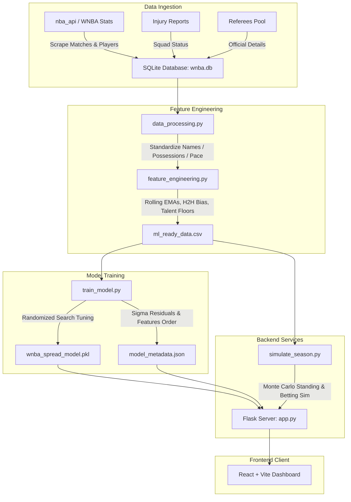
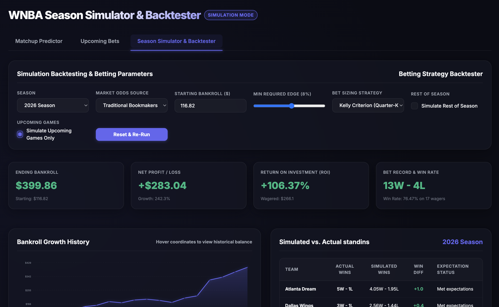

# WNBA Point Spread Prediction & Betting Simulation Pipeline

An end-to-end Machine Learning pipeline and interactive dashboard for WNBA point spread prediction, win probability forecasting, and betting simulation. 

This system uses historical team stats, player metrics, referee bias, schedule rest days, and squad health (injury impact) to train an **XGBoost Regressor** that predicts point margins. It maps predictions to win probabilities and backtests betting strategies (Flat betting vs. Kelly Criterion) against traditional bookmaker odds and Polymarket prices.

---

## 🏗️ Architecture Flow



---

## 📂 Project Structure & Components

### 🗄️ 1. Database & Ingestion
- **[db_manager.py](file:///Users/santomukiza/Desktop/Github/ML-WnbaPrediction/db_manager.py)**: Initializes the SQLite database (`wnba.db` / `frontend/wnba.db`) and defines schemas for:
  - `raw_matches`: Historical scores, actual referee crews (`CrewChief`, `HomeRef`, `AwayRef`), and bookmaker odds.
  - `player_stats`: Historic WNBA player statistics (Games Played, Minutes, Usage %, BPM, Win Shares).
  - `historical_inactives`: Historical inactive players recorded on each game date, used for leak-free squad health tracking.
  - `injuries`: Dynamic team injury states (fallback for upcoming matchups).
  - `polymarket_odds`: Implied YES/NO contract prices for matches.
- **[scrape_combined.py](file:///Users/santomukiza/Desktop/Github/ML-WnbaPrediction/scrape_combined.py)**: A high-performance, combined scraper that extracts both officiating crews and inactive player lists from the WNBA Stats API in a single round-trip per game, bypassing rate limits using User-Agent overrides and randomized request jitter. Replicates database edits to the frontend.
- **[scrape_inactives.py](file:///Users/santomukiza/Desktop/Github/ML-WnbaPrediction/scrape_inactives.py)**: Specific scraper designed to backfill historic box score inactive rosters from seasons 2018–2026 into the `historical_inactives` table. Replicates database edits to the frontend.
- **[scrape_referees.py](file:///Users/santomukiza/Desktop/Github/ML-WnbaPrediction/scrape_referees.py)**: Specific scraper designed to backfill historic box score officiating crews from seasons 2018–2026 into `raw_matches`. Replicates database edits to the frontend.
- **[scrape_polymarket.py](file:///Users/santomukiza/Desktop/Github/ML-WnbaPrediction/scrape_polymarket.py)**: Scrapes WNBA outcome contract odds and trading volumes from the Polymarket Gamma API, syncing them into `polymarket_odds` for web and simulation consumption.
- **[scrape_oddsshark.py](file:///Users/santomukiza/Desktop/Github/ML-WnbaPrediction/scrape_oddsshark.py)**: Parses public historical betting spreads and totals to populate baseline market odds.
- **[populate_db.py](file:///Users/santomukiza/Desktop/Github/ML-WnbaPrediction/populate_db.py)**: Ingests WNBA league standings, schedules, raw match scores, player game logs, tracks historical ELO ratings, and fetches live FanDuel scoreboard odds.
- **[fanduel_odds.py](file:///Users/santomukiza/Desktop/Github/ML-WnbaPrediction/fanduel_odds.py)**: Scrapes WNBA scoreboard JSON feed from Action Network, parsing pre-match spreads, moneylines, and totals.
- **[build_squad_health.py](file:///Users/santomukiza/Desktop/Github/ML-WnbaPrediction/build_squad_health.py)**: Compiles active team rosters and calculates team injury impact ratios for the upcoming/current match, exporting them to `current_squad_health.csv`.

### 🧪 2. Data Processing & Features
- **[data_processing.py](file:///Users/santomukiza/Desktop/Github/ML-WnbaPrediction/data_processing.py)**: Cleans and standardizes team names, and computes game-level possessions, pace, and defensive/offensive ratings.
- **[feature_engineering.py](file:///Users/santomukiza/Desktop/Github/ML-WnbaPrediction/feature_engineering.py)**: Builds the dataset (`ml_ready_data.csv`) by calculating chronological features including:
  - **Start-of-Season Carry-over Regression**: Handles early-season sample size issues by regressing the starting EMA from the previous season's final values:
     $$EMA_{\text{start}} = 0.75 \cdot EMA_{\text{prev\_season\_final}} + 0.25 \cdot \mu_{\text{league\_mean\_prev\_season}}$$
  - **Chronological Global Means**: Imputes missing values using only games *prior* to the current game's date, preventing look-ahead bias.
  - **Dynamic, Leak-Free Squad Health**: Queries the `historical_inactives` table for historical games on Date $D$ to dynamically calculate missing usage, BPM, and minutes, falling back to the active `injuries` table only for future matchups.
  - **Team EMA Ratings**: 5-game and 10-game Exponential Moving Averages of Offensive, Defensive, and Net Ratings.
  - **Four Factors EMA**: eFG%, TOV%, ORB%, and FT Rate.
  - **Talent Floor**: Roster total Win Shares from the previous season.
  - **Schedule Rest**: Days of rest, back-to-backs, and 3-in-4 game flags.
  - **Referee EMA**: Crew Chief, HomeRef, and AwayRef historical total points, fouls called, and home-win percentage.
  - **H2H Bias**: Home team win rate against this specific opponent over the last 2 seasons.

### 🤖 3. Machine Learning Model
- **[stacking_models.py](file:///Users/santomukiza/Desktop/Github/ML-WnbaPrediction/stacking_models.py)**: Contains scikit-learn compatible `StackedEnsembleRegressor` and `StackedEnsembleClassifier` wrappers:
  - **StandardScaler Base Pipelines**: Automatically wraps base linear models (`Ridge` and `LogisticRegression`) inside a `StandardScaler` pipeline to ensure feature scaling consistency.
  - **Lasso L1 Stacking Regularization**: Fits `LassoCV` as the meta-regressor and L1-penalized `LogisticRegression` (`penalty='l1'`, `solver='liblinear'`) as the meta-classifier to automatically prune noise-inducing base estimators.
- **[train_model.py](file:///Users/santomukiza/Desktop/Github/ML-WnbaPrediction/train_model.py)**: Implements the training, feature selection, parameter search, and calibration pipeline:
  - **Feature Selection Preprocessing**: Fits a preliminary `XGBRegressor` to compute feature importances and retains only columns with an importance score $\ge 0.002$ to reduce noise.
  - **Dynamic Decay Optimization ($\lambda$)**: Performs grid-search optimization over exponential decay candidates $\lambda \in [0.0001, 0.002]$ within walk-forward CV splits, selecting the look-back horizon that minimizes validation Log Loss (optimal: $\lambda = 0.001$).
  - **Stage 1 (Baseline)**: Trains a baseline stacked ensemble on ELO, schedule rest, and squad health (excluding bookmaker odds) to predict raw point margins (Home - Away).
  - **Stage 2 (Two-Stage Residual)**: Trains a stacked regressor on the full feature set (including bookmaker odds and `'Market_Disagreement'`) to predict the *residual* margin relative to the bookie's `ClosingSpread`.
  - **Quantile Volatility Model**: Trains two separate LightGBM quantile regressors at the 10th and 90th percentiles to forecast dynamic spread volatilities.
  - **Platt / Isotonic Calibration**: Trains two independent `IsotonicRegression` models on out-of-fold cross-validation probabilities (`stage1_calibrator` and `stage2_calibrator`) to scale the final output win probabilities.
- **[predict.py](file:///Users/santomukiza/Desktop/Github/ML-WnbaPrediction/predict.py)**: Handles inference, including feature mean NaN imputation and prediction routing:
  - If closing lines are available, predicts using Stage 2. Dynamic volatility standard deviation is computed from the quantiles:
     $$\sigma_{\text{pred}} = \frac{P_{90} - P_{10}}{2.563}$$
  - Calculates win probability by blending the Normal CDF of the predicted spread/residual ($\Phi$) and the direct stacked classifier output 50/50, and passes it through the fitted calibrator model:
     $$P(\text{Home Win}) = \text{Calibrator}\left(0.5 \cdot \Phi\left(\frac{\mu_{\text{pred}}}{\sigma_{\text{pred}}}\right) + 0.5 \cdot P_{\text{classifier}}\right)$$
  - If closing lines are missing (e.g. future games), routes prediction automatically to Stage 1 ELO fallback models.

### 🎰 4. Betting Simulator & Backtester
- **[simulate_season.py](file:///Users/santomukiza/Desktop/Github/ML-WnbaPrediction/simulate_season.py)**: Runs full season historical simulations. Compares Model, Bookie, and Polymarket probabilities against actual results (via Accuracy, Brier Score, and Log Loss). Simulates betting strategies:
  - **Flat Betting**: Wagering a fixed percentage of initial bankroll (e.g. 2%).
  - **Kelly Criterion**: Dynamic bet sizing proportional to model edge:
     $$f^* = \text{Fractional Factor} \times \frac{P_{\text{model}} \cdot \text{Odds} - 1}{\text{Odds} - 1}$$
    Uses **Quarter-Kelly** (factor of 0.25) capped at 15% of current bankroll.
  - **Monte Carlo Standings**: Performs a 1,000-trial simulation of team win-loss standings to compare model expectations against actual final results.

### 💻 5. Web Interface
- **[app.py](file:///Users/santomukiza/Desktop/Github/ML-WnbaPrediction/app.py)**: Flask REST API serving endpoints for matchups, custom rosters, live predictions (integrating live FanDuel odds with ELO fallback), and the simulation backtester.
- **[frontend/](file:///Users/santomukiza/Desktop/Github/ML-WnbaPrediction/frontend)**: A React-based glassmorphic SPA built with Vite. Consists of a Matchup Predictor (with editable injury rosters) and an interactive Season Simulator dashboard. The Upcoming Bets tab dynamically badges the odds source with `[FanDuel]` or `[ELO]`.

---

## ⚡ Code Execution Order & Pipeline Setup

Follow this sequence of steps to run the pipeline, scrape historical stats, train the stacked ensembles, and launch the web server.

### 🐍 1. Backend Setup & Ingestion Pipeline

1. **Install python packages**:
   ```bash
   pip install numpy pandas xgboost lightgbm catboost scipy scikit-learn Flask Flask-Cors nba-api
   ```

2. **Initialize SQLite Database schemas**:
   ```bash
   python3 db_manager.py
   ```
   *Creates `wnba.db` with core structures for matches, ELOs, injuries, and scrapers.*

3. **Ingest core logs & game logs**:
   ```bash
   python3 populate_db.py
   ```
   *Fetches team profiles, schedules, raw match outcomes, player stats, and sets up ELO ratings.*

4. **Scrape historical box scores (Officiating & Inactives)**:
   You can either run the combined scraper (recommended) or the individual backfill scrapers:
   * **Combined Scraper (Crew Chiefs + Inactive rosters)**:
     ```bash
     python3 scrape_combined.py --seasons 2022 2023 2024 2025 --delay 1.0
     ```
   * **Or Individual Scrapers**:
     ```bash
     python3 scrape_referees.py
     python3 scrape_inactives.py
     ```
   *Pulls crew chiefs, referees, and inactive rosters directly from box scores for leak-free rolling features. Replicates `wnba.db` to `frontend/wnba.db` automatically.*

5. **Compile squad health ratios**:
   ```bash
   python3 build_squad_health.py
   ```
   *Aggregates roster sizes, injured player metrics, and builds `current_squad_health.csv`.*

6. **Process efficiency & possessions**:
   ```bash
   python3 data_processing.py
   ```
   *Standardizes team pacings, possession stats, and efficiency ratings.*

7. **Generate features**:
   ```bash
   python3 feature_engineering.py
   ```
   *Computes rolling EMAs, ELO diffs, start-of-season carry-overs, and outputs the final training file `ml_ready_data.csv`.*

8. **Train the Two-Stage Stacked & Quantile Models**:
   ```bash
   python3 train_model.py
   ```
   *Runs walk-forward out-of-fold stacking, residual regressor, and quantile model fits. Saves `wnba_spread_model.pkl` and `model_metadata.json`.*

9. **Start Flask API Server**:
   ```bash
   python3 app.py
   ```
   *Launches the REST API on port 5001, loading the precalculated weights and serving upcoming bets.*

### ⚛️ Frontend Setup (React)

1. **Navigate to the frontend folder and install packages**:
   ```bash
   cd frontend
   npm install
   ```

2. **Run in local development mode**:
   ```bash
   npm run dev
   ```

3. **Build production assets** (built assets compile to `frontend/dist/` and are served automatically by Flask):
   ```bash
   npm run build
   ```

---

## 📊 Backtester Evaluation Metrics

The simulator evaluates predictive quality using:
- **Accuracy**: Winner classification rate.
- **Brier Score**: Measures probability calibration. Closer to `0` is perfect:
  $$BS = \frac{1}{N} \sum_{t=1}^N (P_t - Y_t)^2$$
- **Log Loss**: Binary cross-entropy penalizing confident incorrect predictions:
  $$LL = -\frac{1}{N} \sum_{t=1}^N \left[ Y_t \ln(P_t) + (1 - Y_t) \ln(1 - P_t) \right]$$
- **ROI (%)**: Return on Investment computed across the total amount wagered over the season.

---

## 🌐 Data Sources & API Reference

The pipeline relies on several official and public endpoints to fetch real-time and historical WNBA data:

1. **WNBA Match & Team Statistics:**
   - **Source:** Official WNBA Stats via the NBA/WNBA API (League ID: `10`).
   - **Libraries used:** [`nba-api`](https://github.com/swar/nba_api)
   - **Endpoints:**
     - [LeagueGameLog Endpoint](https://github.com/swar/nba_api/blob/master/docs/nba_api/stats/endpoints/leaguegamelog.md) for regular season matchups, raw scores, team pacings, and shooting statistics.
     - [LeagueDashPlayerStats Endpoint](https://github.com/swar/nba_api/blob/master/docs/nba_api/stats/endpoints/leaguedashplayerstats.md) for player statistics (Usage %, BPM, and Win Shares).

2. **Live Polymarket Odds:**
   - **Source:** [Polymarket Gamma API](https://gamma-api.polymarket.com/)
   - **Endpoints:**
     - [Gamma Markets Endpoint](https://gamma-api.polymarket.com/markets) (e.g., `https://gamma-api.polymarket.com/markets?active=true&limit=100&query=WNBA`) to fetch active trading contract prices for WNBA matches.
     - YES/NO contract prices represent the real-time market implied probability of win outcomes.

3. **WNBA Squad Injuries:**
   - **Source:** Sports news injury databases, seeded or parsed from:
     - [ESPN WNBA Injury Report](https://www.espn.com/wnba/injuries)
     - [RotoWire WNBA Injury Report](https://www.rotowire.com/wnba/injuries.php)
   - Used to compile squad health ratios and compute team rating adjustments (missing Usage %, BPM, Minutes %).

4. **Referee Pools & Assignments:**
   - Determined deterministically using game keys or parsed from historical box scores on [WNBA official portal](https://www.wnba.com/).

5. **Traditional Bookmaker Odds (FanDuel / ELO Fallback):**
   - **In this Pipeline:** Fetches live pre-match moneylines, spreads, and totals from FanDuel Sportsbook (scraped from Action Network's WNBA scoreboard API). Utilizes a **hybrid fallback model**:
     - If FanDuel has lines for a matchup, they are matched (moneylines, spreads, over/unders, vig-free probabilities) and used.
     - If FanDuel does not have lines (or games are far in the future), the pipeline falls back to ELO-derived odds using `generate_betting_data()`.
     - In `populate_db.py`, matched FanDuel odds are seeded into the database `raw_matches` table, so they are consumed by the Season Simulator & Backtester.
     - The Upcoming Bets tab displays a green `[FanDuel]` or a muted grey `[ELO]` badge next to the odds to indicate the active source.


