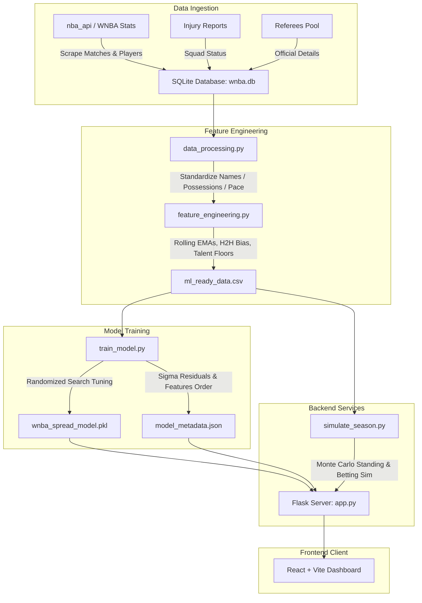

# WNBA Point Spread Prediction & Betting Simulation Pipeline

An end-to-end Machine Learning pipeline and interactive dashboard for WNBA point spread prediction, win probability forecasting, and betting simulation. 

This system uses historical team stats, player metrics, referee bias, schedule rest days, and squad health (injury impact) to train an **XGBoost Regressor** that predicts point margins. It maps predictions to win probabilities and backtests betting strategies (Flat betting vs. Kelly Criterion) against traditional bookmaker odds and Polymarket prices.

---

## 🏗️ Architecture Flow



---

## 📂 Project Structure & Components

### 🗄️ 1. Database & Ingestion
- **[db_manager.py](file:///Users/santomukiza/Desktop/Github/ML-WnbaPrediction/db_manager.py)**: Initializes the SQLite database (`wnba.db`) and defines schemas for:
  - `raw_matches`: Historical scores, referee crew chief, and bookmaker odds.
  - `player_stats`: Historic WNBA player statistics (Games Played, Minutes, Usage %, BPM, Win Shares).
  - `injuries`: Dynamic team injury states.
  - `polymarket_odds`: Implied YES/NO contract prices for matches.
- **[populate_db.py](file:///Users/santomukiza/Desktop/Github/ML-WnbaPrediction/populate_db.py)**: Scrapes player stats and game logs from the WNBA NBA API endpoint, generates referee assignments, tracks ELO ratings, and fetches live FanDuel odds to seed matching matchups in `raw_matches`.
- **[fanduel_odds.py](file:///Users/santomukiza/Desktop/Github/ML-WnbaPrediction/fanduel_odds.py)**: Scrapes WNBA scoreboard JSON feed from Action Network, parses pre-match moneylines, spreads, and totals from FanDuel (Sportsbook ID 30), and maps team abbreviations (e.g. `GS` -> `GSV`, `LA` -> `LAS`) to canonical database representations.
- **[build_squad_health.py](file:///Users/santomukiza/Desktop/Github/ML-WnbaPrediction/build_squad_health.py)**: Compiles active team rosters and calculates team injury impact ratios (missing Usage %, missing BPM, missing Minutes) based on the current injuries table.

### 🧪 2. Data Processing & Features
- **[data_processing.py](file:///Users/santomukiza/Desktop/Github/ML-WnbaPrediction/data_processing.py)**: Cleans and standardizes team names, and computes game-level possessions, pace, and defensive/offensive ratings.
- **[feature_engineering.py](file:///Users/santomukiza/Desktop/Github/ML-WnbaPrediction/feature_engineering.py)**: Builds the dataset (`ml_ready_data.csv`) by calculating chronological features including:
  - **Team EMA Ratings**: 5-game and 10-game Exponential Moving Averages of Offensive, Defensive, and Net Ratings.
  - **Four Factors EMA**: eFG%, TOV%, ORB%, and FT Rate.
  - **Talent Floor**: Roster total Win Shares from the previous season.
  - **Schedule Rest**: Days of rest, back-to-backs, and 3-in-4 game flags.
  - **Referee EMA**: Crew Chief historical total points, fouls called, and home-win percentage.
  - **H2H Bias**: Home team win rate against this specific opponent over the last 2 seasons.

### 🤖 3. Machine Learning Model
- **[train_model.py](file:///Users/santomukiza/Desktop/Github/ML-WnbaPrediction/train_model.py)**: Tunes and trains the XGBoost Regressor using a chronological split (Training: 2018–2024, Validation: 2025–2026). Saves the model (`wnba_spread_model.pkl`) and features order/standard deviation of residuals (`model_metadata.json`).
- **[predict.py](file:///Users/santomukiza/Desktop/Github/ML-WnbaPrediction/predict.py)**: Generates point spread predictions ($\mu_{\text{pred}}$) and maps them to home win probabilities ($P$) using the Normal Cumulative Distribution Function (CDF):
  \[
  P(\text{Home Win}) = \Phi\left(\frac{\mu_{\text{pred}}}{\sigma_{\text{residuals}}}\right)
  \]

### 🎰 4. Betting Simulator & Backtester
- **[simulate_season.py](file:///Users/santomukiza/Desktop/Github/ML-WnbaPrediction/simulate_season.py)**: Runs full season historical simulations. Compares Model, Bookie, and Polymarket probabilities against actual results (via Accuracy, Brier Score, and Log Loss). Simulates betting strategies:
  - **Flat Betting**: Wagering a fixed percentage of initial bankroll (e.g. 2%).
  - **Kelly Criterion**: Dynamic bet sizing proportional to model edge:
    \[
    f^* = \text{Fractional Factor} \times \frac{P_{\text{model}} \cdot \text{Odds} - 1}{\text{Odds} - 1}
    \]
    Uses **Quarter-Kelly** (factor of 0.25) capped at 15% of current bankroll.
  - **Monte Carlo Standings**: Performs a 1,000-trial simulation of team win-loss standings to compare model expectations against actual final results.

### 💻 5. Web Interface
- **[app.py](file:///Users/santomukiza/Desktop/Github/ML-WnbaPrediction/app.py)**: Flask REST API serving endpoints for matchups, custom rosters, live predictions (integrating live FanDuel odds with ELO fallback), and the simulation backtester.
- **[frontend/](file:///Users/santomukiza/Desktop/Github/ML-WnbaPrediction/frontend)**: A React-based glassmorphic SPA built with Vite. Consists of a Matchup Predictor (with editable injury rosters) and an interactive Season Simulator dashboard. The Upcoming Bets tab dynamically badges the odds source with `[FanDuel]` or `[ELO]`.

---

## ⚡ Quick Start

### 🐍 Backend Setup (Python)

1. **Install dependencies**:
   ```bash
   pip install numpy pandas xgboost scipy scikit-learn Flask Flask-Cors nba-api
   ```

2. **Initialize and populate the SQLite Database**:
   ```bash
   python3 db_manager.py
   python3 populate_db.py
   ```

3. **Compute Squad Health & Standardize Data**:
   ```bash
   python3 build_squad_health.py
   python3 data_processing.py
   ```

4. **Engineer Features & Train Model**:
   ```bash
   python3 feature_engineering.py
   python3 train_model.py
   ```

5. **Start Flask API Server**:
   ```bash
   python3 app.py
   ```

### ⚛️ Frontend Setup (React)

1. **Navigate to the frontend folder and install packages**:
   ```bash
   cd frontend
   npm install
   ```

2. **Run in local development mode**:
   ```bash
   npm run dev
   ```

3. **Build production assets** (built assets compile to `frontend/dist/` and are served automatically by Flask):
   ```bash
   npm run build
   ```

---

## 📊 Backtester Evaluation Metrics

The simulator evaluates predictive quality using:
- **Accuracy**: Winner classification rate.
- **Brier Score**: Measures probability calibration. Closer to `0` is perfect:
  \[
  BS = \frac{1}{N} \sum_{t=1}^N (P_t - Y_t)^2
  \]
- **Log Loss**: Binary cross-entropy penalizing confident incorrect predictions:
  \[
  LL = -\frac{1}{N} \sum_{t=1}^N \left[ Y_t \ln(P_t) + (1 - Y_t) \ln(1 - P_t) \right]
  \]
- **ROI (%)**: Return on Investment computed across the total amount wagered over the season.

---

## 🌐 Data Sources & API Reference

The pipeline relies on several official and public endpoints to fetch real-time and historical WNBA data:

1. **WNBA Match & Team Statistics:**
   - **Source:** Official WNBA Stats via the NBA/WNBA API (League ID: `10`).
   - **Libraries used:** [`nba-api`](https://github.com/swar/nba_api)
   - **Endpoints:**
     - [LeagueGameLog Endpoint](https://github.com/swar/nba_api/blob/master/docs/nba_api/stats/endpoints/leaguegamelog.md) for regular season matchups, raw scores, team pacings, and shooting statistics.
     - [LeagueDashPlayerStats Endpoint](https://github.com/swar/nba_api/blob/master/docs/nba_api/stats/endpoints/leaguedashplayerstats.md) for player statistics (Usage %, BPM, and Win Shares).

2. **Live Polymarket Odds:**
   - **Source:** [Polymarket Gamma API](https://gamma-api.polymarket.com/)
   - **Endpoints:**
     - [Gamma Markets Endpoint](https://gamma-api.polymarket.com/markets) (e.g., `https://gamma-api.polymarket.com/markets?active=true&limit=100&query=WNBA`) to fetch active trading contract prices for WNBA matches.
     - YES/NO contract prices represent the real-time market implied probability of win outcomes.

3. **WNBA Squad Injuries:**
   - **Source:** Sports news injury databases, seeded or parsed from:
     - [ESPN WNBA Injury Report](https://www.espn.com/wnba/injuries)
     - [RotoWire WNBA Injury Report](https://www.rotowire.com/wnba/injuries.php)
   - Used to compile squad health ratios and compute team rating adjustments (missing Usage %, BPM, Minutes %).

4. **Referee Pools & Assignments:**
   - Determined deterministically using game keys or parsed from historical box scores on [WNBA official portal](https://www.wnba.com/).

5. **Traditional Bookmaker Odds (FanDuel / ELO Fallback):**
   - **In this Pipeline:** Fetches live pre-match moneylines, spreads, and totals from FanDuel Sportsbook (scraped from Action Network's WNBA scoreboard API). Utilizes a **hybrid fallback model**:
     - If FanDuel has lines for a matchup, they are matched (moneylines, spreads, over/unders, vig-free probabilities) and used.
     - If FanDuel does not have lines (or games are far in the future), the pipeline falls back to ELO-derived odds using `generate_betting_data()`.
     - In `populate_db.py`, matched FanDuel odds are seeded into the database `raw_matches` table, so they are consumed by the Season Simulator & Backtester.
     - The Upcoming Bets tab displays a green `[FanDuel]` or a muted grey `[ELO]` badge next to the odds to indicate the active source.
